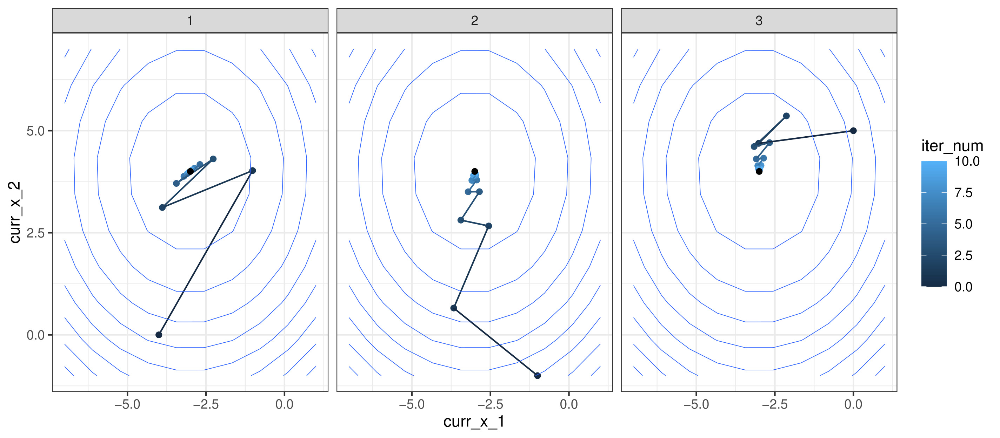

<!-- README.md is generated from README.Rmd. Please edit that file -->

```{r, include = FALSE}
knitr::opts_chunk$set(
  collapse = TRUE,
  comment = "#>",
  fig.path = "man/figures/README-",
  out.width = "100%"
)
```

# DistGD

<!-- badges: start -->
<!-- badges: end -->

The goal of DistGD (Distributed Gradient Descent) is to efficiently optimize a global objective function expressed as a sum of a list of local objective functions belonging to different agents situated in a network via a cluster architecture like [Spark](https://spark.apache.org/). You supply a list of local objective functions, weights of the connections between the agents, initialize a vector initial values, and it takes care of the details, returning the optimal values. 

*You can read more about the [reference](papers/yang_et_al_2019.pdf) and the [write-up](papers/report) for this library.*

## Installation

You can install the development version of DistGD from [GitHub](https://github.com/bosafoagyare/DistGD/) with:

``` r
install.packages("devtools")
devtools::install_github("bosafoagyare/DistGD")
```

## Example
### Implementing Ordinary Logistic Regression for a very big data   

**Simulate data:**

``` r
X       <- rnorm(n = 1000, 0, 1)
epsilon <- rnorm(n = 1000, 0, 1)
X       <- cbind(rep(1, 1000),X)
beta    <- c(-3,4)

Y       <- X%*%beta + epsilon
```


**Distribute data and cost function to agents**
``` r
regress_loss <- function(beta_hat){
  return(sum((Y - X%*%beta_hat)^2))
}


regress_loss_1 <- function(beta_hat){
  return(sum((Y[1:300] - X[1:300,]%*%beta_hat)^2))
}
environment(regress_loss_1) <- list2env(x = list(X = X, Y = Y))


regress_loss_2 <- function(beta_hat){
  return(sum((Y[301:700] - X[301:700,]%*%beta_hat)^2))
}
environment(regress_loss_2) <- list2env(x = list(X = X, Y = Y))


regress_loss_3 <- function(beta_hat){
  return(sum((Y[701:1000] - X[701:1000,]%*%beta_hat)^2))
}
environment(regress_loss_3) <- list2env(x = list(X = X, Y = Y))

```

**Fit the model and submit to Spark**
``` r
lm.fit(X[1:30,], Y[1:30])$coefficients
lm.fit(X[31:70,], Y[31:70])$coefficients
lm.fit(X[71:100,], Y[71:100])$coefficients

lm.fit(X, Y)$coefficients

sc <- spark_connect(master = "local")

trace <- run_dgd(
  sc,
  f_list = list(regress_loss_1, 
                regress_loss_2,
                regress_loss_3),
  grad_list = NULL,
  init_xs = list(c(-4,0), c(-1,-1), c(0,5)),
  init_step_size = 0.001,
  weight_mat = rbind(c(1/3, 1/3, 1/3), 
                     c(1/3, 1/3, 1/3), 
                     c(1/3, 1/3, 1/3)),
  num_iters = 10,
  print = TRUE,
  make_trace = TRUE
)
```

**Collect results and visualize the traces**
``` r
iterations <- data.frame(trace)

iterations

beta_0 <- c()
beta_1 <- c()

for (i in 1:33) {
  beta_0[i] <- iterations$curr_x[[i]][1]
  beta_1[i] <- iterations$curr_x[[i]][2]
}

iterations['beta_0'] <- beta_0
iterations['beta_1'] <- beta_1

grid <- expand.grid(beta_0 = seq(from = -6, to = 1, length.out = 100),
                    beta_1 = seq(from = -1, to = 6, length.out = 100))
z <- c()
for (i in 1:dim(grid)[1]) {
  z[i] <- regress_loss(c(grid[i,1], grid[i,2]))
}
grid['loss'] <- z

plt <- ggplot() + 
        geom_path(data=iterations, aes(beta_0, beta_1, group=f_id, colour = factor(f_id))) +
        geom_contour(data=grid, aes(beta_0, beta_1, z = loss), size=0.2) +
        scale_colour_discrete("local function")
plt
```

**Visualization of output**



## Reference
If you use DistGD, please cite the following paper:
```
@article{Tao:2019,
 title = {A survey of distributed optimization},
 author = {Tao Yang, Xinlei Yi},
 volume = {47},
 pages = {278--305},
 year = 2019,
 journal = {Annual Reviews in Control}
}
```


## License
DistGD is MIT licensed, as found in the [LICENSE](LICENSE) file
